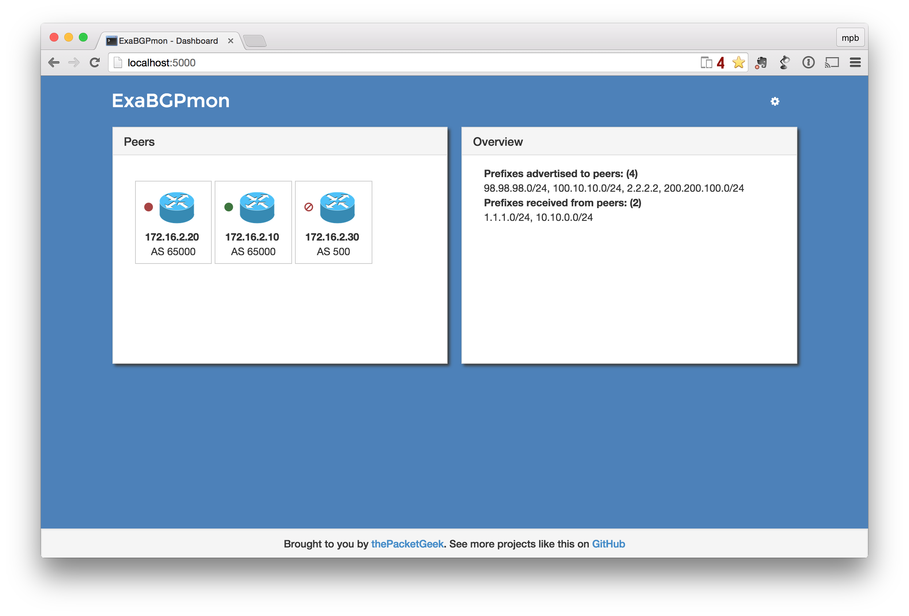
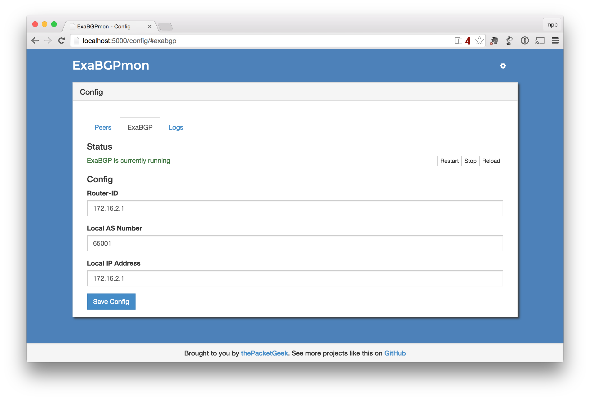

# ExaBGPmon
An HTTP frontend to the glorious ExaBGP

### Features
* Configure ExaBGP and auto-generate a config file
* Monitor and manage peers
	* Control routes advertised
    * Automatically re-advertise when ExaBGP or peer comes back online
* View prefixes received from peers

### Running ExaBGPmon
* Install and start MongoDB
* Install dependencies
    * `pip install -r requirements`
    * This will install exabgp & supervisord
* Inititialize
    * `python manage.py init_config`
* Start Supervisor and ExaBGPmon
    * supervisord
    * supervisorctl start exabgpmon
    * supervisorctl start exabgp
* Configure and restart ExaBGP through GUI
	* Configuration file will automatically be updated

